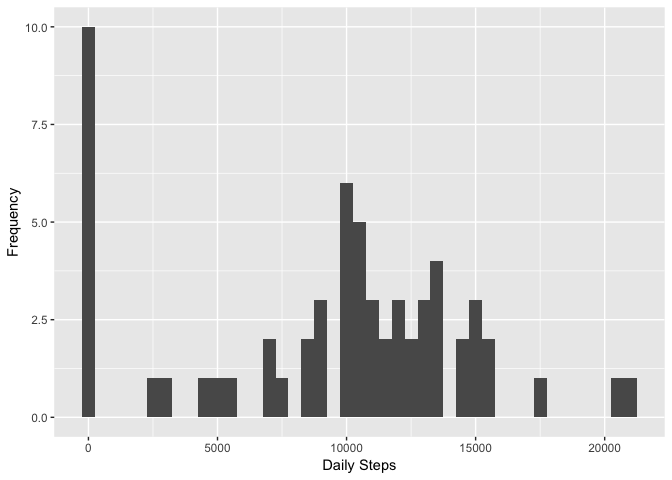
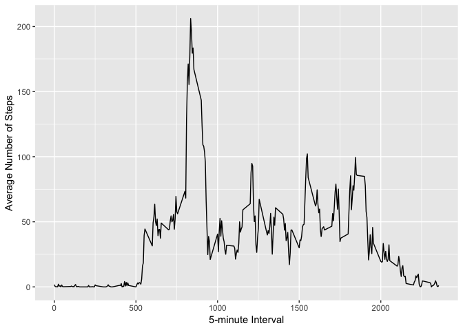
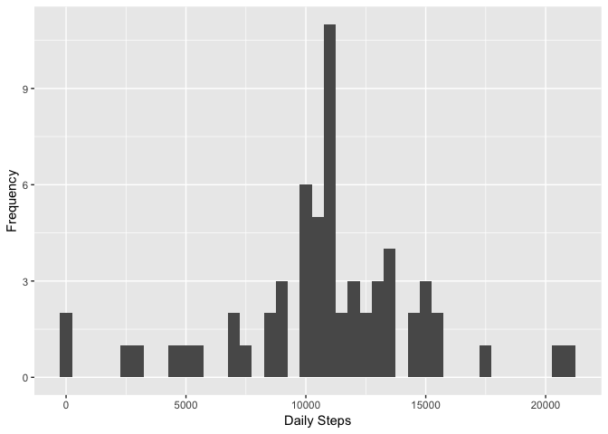
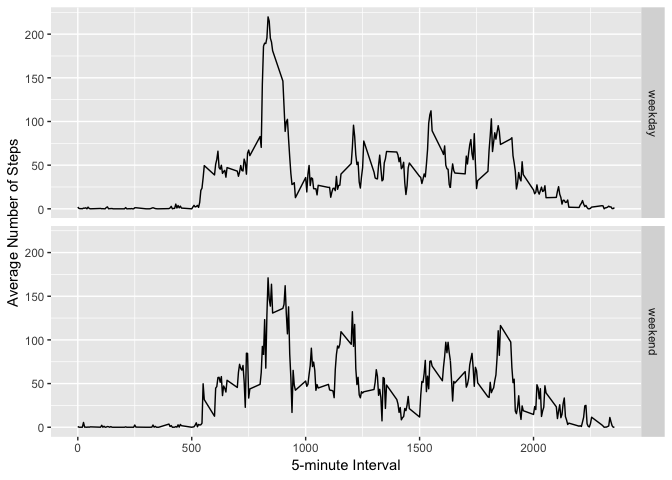

## Loading and preprocessing the data

Set working directory and open required packages

```r
setwd("~/Desktop/DataScienceSpecialization/Course5/RepData_PeerAssessment1")

library(lubridate)
```

```
## 
## Attaching package: 'lubridate'
```

```
## The following object is masked from 'package:base':
## 
##     date
```

```r
library(ggplot2)
library("data.table")
```

```
## 
## Attaching package: 'data.table'
```

```
## The following objects are masked from 'package:lubridate':
## 
##     hour, isoweek, mday, minute, month, quarter, second, wday,
##     week, yday, year
```

Read data into R

```r
activity <- read.csv("activity.csv")
activity <- data.table(activity)
```

Clean up date, times, intervals

```r
activity$date <- ymd(activity$date)
activity$time <- make_datetime(year = year(activity$date), month = month(activity$date), 
                                day = day(activity$date), 
                                hour = ((activity$interval %/% 10^2) %% 10^2), 
                                min = ((activity$interval %/% 10^0) %% 10^2))
```

## What is mean total number of steps taken per day?

Total steps per day

```r
steps_day <- tapply(activity$steps, activity$date, sum, na.rm = TRUE)
```

Histogram of the total number of steps taken each day

```r
qplot(steps_day, xlab = "Daily Steps", ylab = "Frequency", binwidth = 500)
```

<!-- -->

Calculate and report the mean and median of the total number of steps taken per day

```r
steps_dayMean <- mean(steps_day, na.rm = TRUE)
print(steps_dayMean)
```

```
## [1] 9354.23
```

```r
steps_dayMedian <- median(steps_day, na.rm = TRUE)
print(steps_dayMedian)
```

```
## [1] 10395
```

## What is the average daily activity pattern?

Average daily activity pattern

```r
steps_interval <- aggregate(x = list(avg_steps = activity$steps), by = list(interval = activity$interval), FUN=mean, na.rm=TRUE)
```

Make a time series plot (type = "1") of the 5-minute interval (x-axis) and the average number of steps taken, averaged across all days (y-axis)

```r
ggplot(data = steps_interval, aes(x = interval, y = avg_steps)) +
  geom_line() +
  xlab("5-minute Interval") +
  ylab("Average Number of Steps") 
```

<!-- -->

Which 5-minute interval, on average across all the days in the dataset, contains the maximum number of steps?

```r
max_steps <- which.max(steps_interval$avg_steps)
max_steps_time <- gsub("([0-9]{1,2})([0-9]{2})", "\\1:\\2", steps_interval[max_steps,'interval'])
print(paste0("Most steps at time interval: ", max_steps_time))
```

```
## [1] "Most steps at time interval: 8:35"
```

## Imputing missing values

Calculate and report the total number of missing values in the dataset 

```r
na_num <- length(which(is.na(activity$steps)))
print(paste0("Number of missing values: ", na_num))
```

```
## [1] "Number of missing values: 2304"
```

Strategy for missing values: set them as mean of that respective 5 minute interval
Create a new dataset that is equal to the original dataset but with the missing data filled in.


```r
activity2 <- activity
for(i in 1:nrow(activity2)){
  if(is.na(activity2$steps[i]) == TRUE) {
    activity2$steps[i] <- steps_interval[activity2$interval[i] == steps_interval$interval,]$avg_steps
    }
}
```

Make a histogram of the total number of steps taken each day (using imputed data)  

```r
steps_day2 <- tapply(activity2$steps, activity2$date, sum)
qplot(steps_day2, xlab = "Daily Steps", ylab = "Frequency", binwidth = 500)
```

<!-- -->

Calculate and report the mean and median steps taken per day (using imputed data) 

```r
steps_day2Mean <- mean(steps_day2, na.rm = TRUE)
print(steps_day2Mean)
```

```
## [1] 10766.19
```

```r
steps_day2Median <- median(steps_day2, na.rm = TRUE)
print(steps_day2Median)
```

```
## [1] 10766.19
```

## Are there differences in activity patterns between weekdays and weekends?

Create a new factor variable in the dataset with two levels – “weekday” and “weekend” indicating whether a given date is a weekday or weekend day

```r
weekday <- c("Monday", "Tuesday", "Wednesday", "Thursday", "Friday")
activity2$daytype <- ifelse(
  weekdays(as.POSIXct(activity2$date), abbreviate = FALSE) %in% weekday, 
  "weekday", "weekend")
```

Time series of average steps of each 5 minute interval, by day type

```r
steps_interval2 <- aggregate(steps ~ interval + daytype, data = activity2, mean)
ggplot(steps_interval2, aes(interval, steps)) + 
  geom_line() + 
  facet_grid(daytype ~ .) +
  xlab("5-minute Interval") + 
  ylab("Average Number of Steps")
```

<!-- -->

